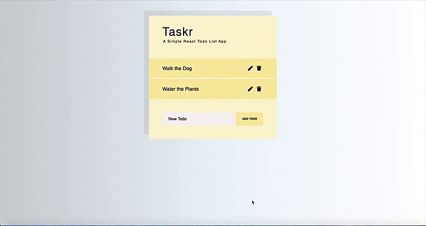

# [Taskr Todo App](https://taskr-todo.netlify.app)

A Simple React Todo App built with class components.
[Deployed App](https://taskr-todo.netlify.app)

## Short demo:

## Installation

1. `git clone git@github.com:dorabelme/Taskr.git`
2. `npm install`
3. `npm start`
